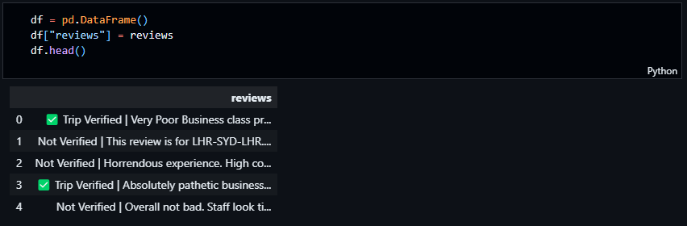
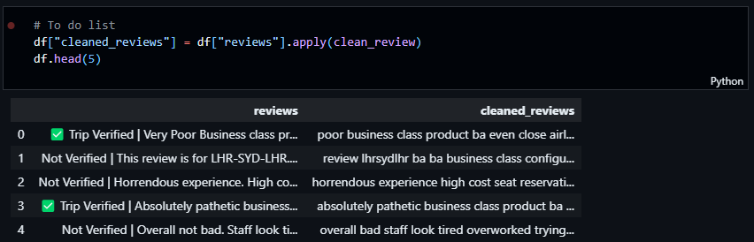

# BritishAirways-data-science

This Project is job simulation for British Airways Data Science role. The project is divided into 3 parts.

## Part 1: Data Analysis

I used numpy, pandas, matplotlib and seaborn libraries to analyse the data. I used jupyter notebook to write the code. The code is in the file `Data Analysis.ipynb`. The code is well documented and easy to understand. The code is divided into 3 parts:

1. Web Scraping
2. Data Cleaning
3. Data Analysis
4. Data Visualization

### Web Scraping

I scraped the data from the website <https://www.airlinequality.com/airline-reviews/british-airways/>. I used BeautifulSoup library to scrape the data. I scraped the following data:

```

```

### Data Cleaning

I cleaned data by removing verification status from each review

```

```

### Data Analysis

- I fitted an LDA model to the data and found the top 10 topics
- I found the top 10 words for each topic
- I conductd sentiment analysis on the data and found the top 10 positive and negative words

### Data Visualization

- I visualized the distribuution of the LDA topic model

- I visualized the distribution of the sentiment analysis on each review

### How to reproduce the results

#### clone the repository

```
git clone https:\\github.com\Simontagbor\BritishAirways-data-science.git
```

#### create a virtual environment

```
python -m venv venv
```

or if you are using anaconda

```
conda create -n venv
```

or if you are using mkvirtualenv

```
mkvirtualenv venv
```

#### install the requirements

```
pip install -r requirements.txt
```

#### run the jupyter notebook

```
jupyter notebook
```

#### connect to the jupyter notebook in your browser

```
http://localhost:8888/
```
